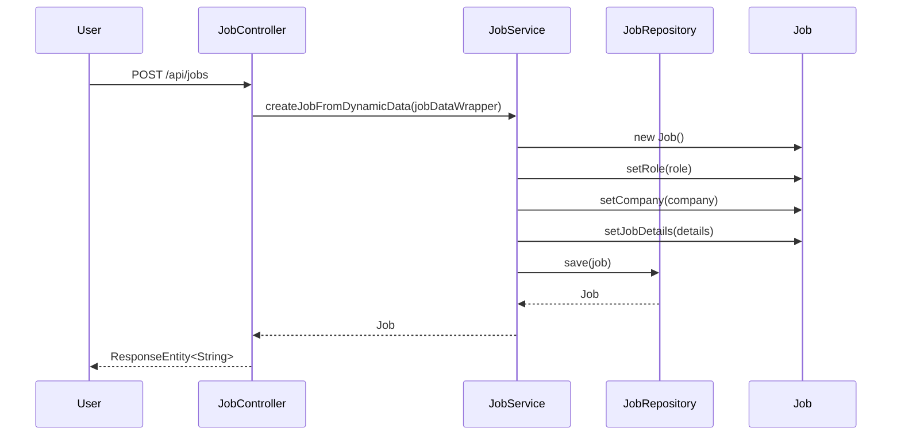

```mermaid
sequenceDiagram
    participant User
    participant JobController
    participant JobService
    participant JobRepository
    participant Job

    User->>JobController: POST /api/jobs
    JobController->>JobService: createJobFromDynamicData(jobDataWrapper)
    JobService->>Job: new Job()
    JobService->>Job: setRole(role)
    JobService->>Job: setCompany(company)
    JobService->>Job: setJobDetails(details)
    JobService->>JobRepository: save(job)
    JobRepository-->>JobService: Job
    JobService-->>JobController: Job
    JobController-->>User: ResponseEntity<String>
```